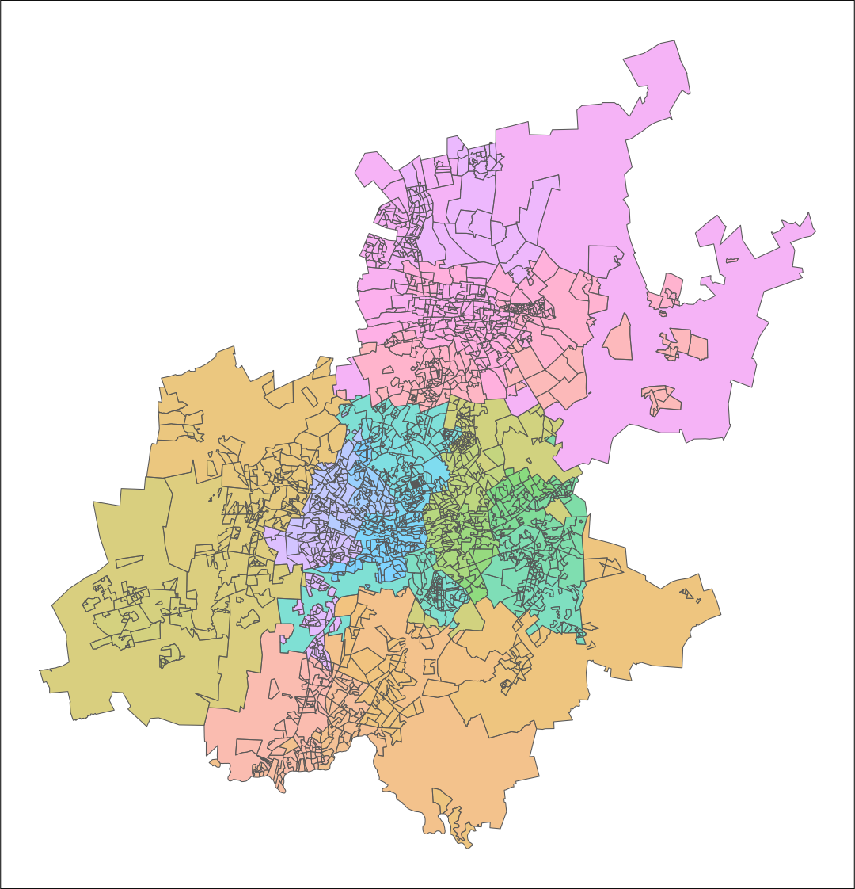

<!-- README.md is generated from README.Rmd. Please edit that file -->

```{r setup, include = FALSE}
library(dplyr)
library(ggplot2)
library(ragg)
library(lubridate)
library(tidyr)
library(ggplot2)
library(sf)

knitr::opts_chunk$set(
  eval = FALSE,
  echo = TRUE,
  warning = FALSE,
  message = FALSE,
  include = TRUE,
  comment = "#>",
  fig.align = "center",
  fig.path = "man/figures/README-",
  dev = "ragg_png",
  dpi = 180,
  fig.retina = 2,
  cache = FALSE,
  cache.path = "man/cache/README-"
)
```

# `sasf`

<!-- badges: start -->
[](https://lifecycle.r-lib.org/articles/stages.html#experimental)
[](https://CRAN.R-project.org/package=sasf)
<!-- badges: end -->

The goal of `sasf` is to simplify the process of loading and visualising spatial data for South Africa in `R`.
Shapefiles encompass various administrative levels, such as provinces, districts, municipalities, main places, and subplaces, using Census 2011 demarcations.

The main dataset of interest `subplaces` data frame is embedded in the package. 
`_id` columns represent unique numeric identifiers, while `_name` columns provide descriptive names.
`_mdb` columns present string identifiers corresponding to the demarcations of the Municipal Demarcation Board of South Africa for provinces, districts, and municipalities.

`subplaces` is structured hierarchically on the basis of `_id` values, with the exception of districts.
Consider, for example, the subplace "Wemmershoek":

- `subplace_id`: 167007001
- `mainplace_id`: 167007
- `municipality_id`: 167
- `province_id`: 1

## Installation

<!-- This package requires a working installation of [`sf`](https://github.com/r-spatial/sf#installing). -->

You can install the development version of `sasf` from [GitHub](https://github.com/) with:

``` r
# install.packages("remotes")
remotes::install_github("WihanZA/sasf")
```

## Basics

```{r basics, eval = TRUE, cache = TRUE}
# lazy loading of data
lobstr::mem_used()
library(sasf)
lobstr::mem_used()
invisible(subplaces)
lobstr::mem_used()

# geographic hierarchy
subplaces %>%
  # exclude sfc geometry column
  as.data.frame() %>%
  select(ends_with("_id")) %>%
  pivot_longer(everything()) %>%
  group_by(name) %>%
  summarise(n = n_distinct(value)) %>%
  arrange(desc(n))

# filtering
subplaces %>%
  filter(grepl("stellenbosch", municipality_name, ignore.case = TRUE)) %>%
  head()

# plotting
subplaces %>%
  ggplot() +
  geom_sf(
    color = "grey50",
    fill = "white"
  )
```

```{r plot-defaults, eval = TRUE, cache = FALSE}
# set default ggplot theme
theme_set(
  theme_void() +
    theme(
      legend.position = "bottom",
      legend.box = "vertical"
    )
)

# set GeomSf defaults
update_geom_defaults(
  "sf",
  list(alpha = 0.5)
)
```

```{r plot-defaults-example, eval = TRUE, cache = TRUE}
# filtering
# group_by + summarise amounts to sf::st_union()
# plot using defaults
subplaces %>%
  filter(province_name == "Western Cape") %>%
  group_by(district_name) %>%
  summarise() %>%
  ggplot() +
  geom_sf(
    aes(fill = district_name),
    color = "grey50"
  ) +
  labs(
    fill = "District Muncipality",
    title = "Western Cape Districts"
  )
```

## Helper Functions

```{r get-asp, eval = TRUE, cache = TRUE}
# inappropriate figure aspect ratios cause whitespace
ratios <- get_asp(
  sf_obj = subplaces,
  target_width = 6
)

# normal & latitude adjusted (for geographic coordinates) ratios
# corresponding figure heights
ratios
```

```{r asp-example, eval = TRUE, cache = TRUE}
# illustrate using Gauteng example
gauteng <- subplaces %>%
  filter(province_name == "Gauteng")

# after subsetting subplaces
# optimal aspect ratio changes
ratios_gauteng <- get_asp(gauteng, 6)

# plot gauteng subplaces and save
gauteng_plot <- gauteng %>%
  ggplot() +
  geom_sf(
    aes(fill = subplace_id),
    show.legend = FALSE
  ) +
  theme(
    panel.background = element_rect(fill = "white"),
    plot.background = element_rect(fill = "grey50")
  )

ggsave(
  filename = "asp.png",
  plot = gauteng_plot,
  device = ragg::agg_png,
  path = "man/figures",
  width = ratios_gauteng$target_width,
  height = ratios_gauteng$target_height,
  dpi = 180
)

ggsave(
  filename = "asp_adj.png",
  plot = gauteng_plot,
  device = ragg::agg_png,
  path = "man/figures",
  width = ratios_gauteng$target_width,
  height = ratios_gauteng$target_height_adj,
  dpi = 180
)
```

```{r print-asp-examples, eval = TRUE}
knitr::include_graphics("man/figures/asp.png")

```


# Acknowledgements

- The definitions and demarcations used in Census 2011 are detailed in the corresponding *[metadata](https://www.statssa.gov.za/census/census_2011/census_products/Census_2011_Metadata.pdf)*, published by Statistics South Africa (2012).

- The wiki by [konektaz](https://github.com/konektaz) offers a useful summary of the hierarchical structure of spatial layers: *[South Africa Census 2011 spatial metadata](https://github.com/konektaz/shape-files/wiki/South-Africa---Census-2011-spatial-metadata)*

- The original shapefiles were sourced from the [OpenUp Data Portal](https://data.openup.org.za/) at this link: *[Census 2011 Boundaries Subplace Layer](https://data.openup.org.za/dataset/census-2011-boundaries-subplace-layer-qapr-gczi/)*

# Session Information

```{r info, eval = TRUE, cache = FALSE}
sessionInfo()
```