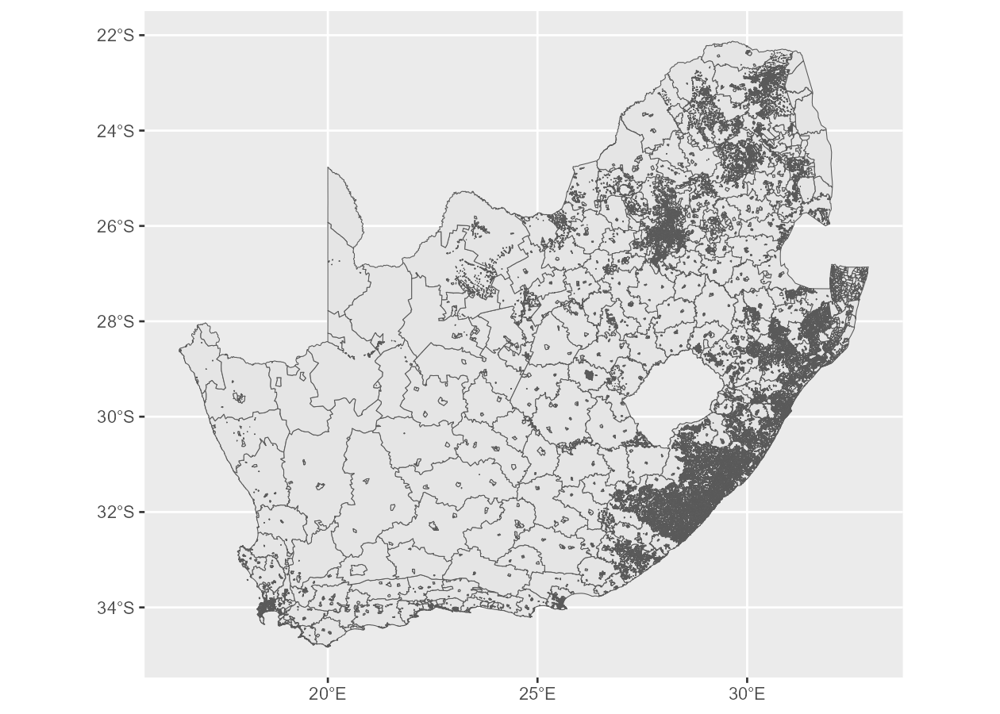
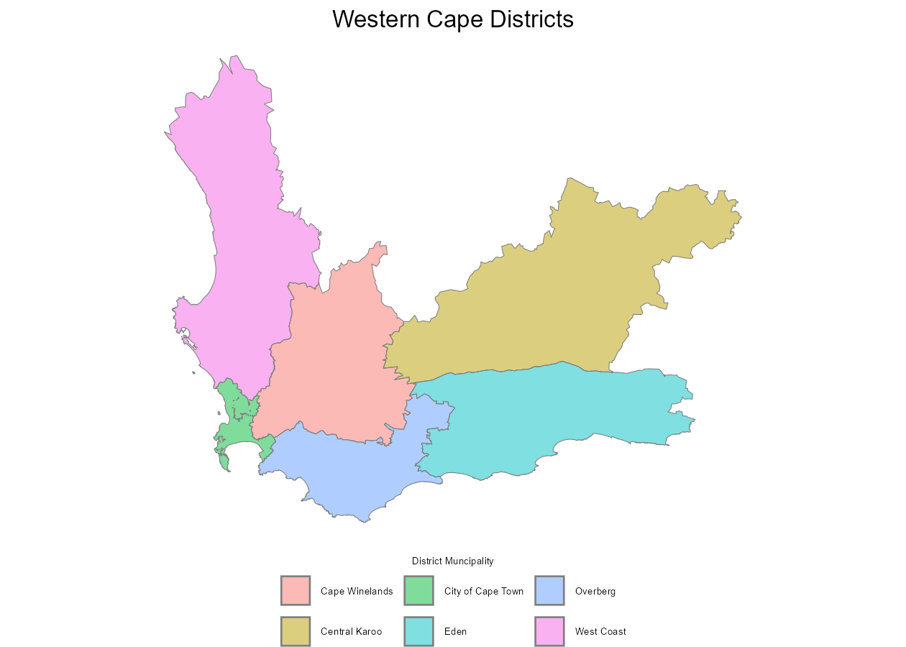
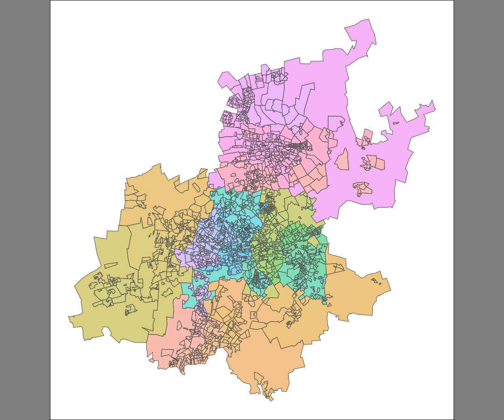
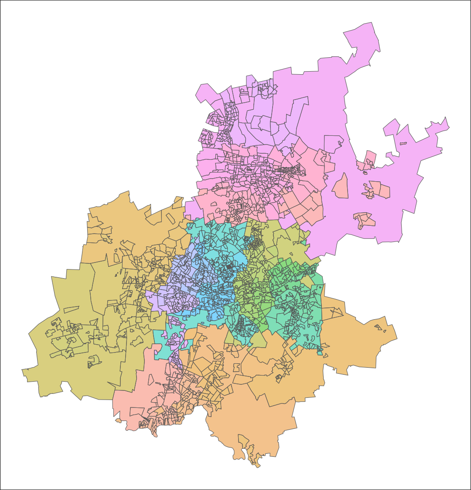

<!-- README.md is generated from README.Rmd. Please edit that file -->

# `sasf`

<!-- badges: start -->

[](https://lifecycle.r-lib.org/articles/stages.html#experimental)
[](https://CRAN.R-project.org/package=sasf)
<!-- badges: end -->

The goal of `sasf` is to simplify the process of loading and visualising
spatial data for South Africa in `R`. Shapefiles encompass various
administrative levels, such as provinces, districts, municipalities,
mainplaces, and subplaces, using Census 2011 demarcations.

The main dataset of interest `subplaces` data frame is embedded in the
package. `_id` columns represent unique numeric identifiers, while
`_name` columns provide descriptive names. `_mdb` columns present string
identifiers corresponding to the demarcations of the Municipal
Demarcation Board of South Africa for provinces, districts, and
municipalities.

## Installation

<!-- This package requires a working installation of [`sf`](https://github.com/r-spatial/sf#installing). -->

You can install the development version of `sasf` from
[GitHub](https://github.com/) with:

``` r
# install.packages("remotes")
remotes::install_github("WihanZA/sasf")
```

## Basics

``` r
# load the package
library(sasf)

# recommended packages
library(dplyr)
library(tidyr)
library(ggplot2)
library(sf)
library(ragg)
```

Somewhat large datasets are lazily loaded to reduce the demand on your
system’s memory when they’re not in use. See memory usage before and
after loading the `subplaces` dataset.

``` r
lobstr::mem_used()
```

    #> 66.00 MB

``` r
invisible(subplaces)
lobstr::mem_used()
```

    #> 109.39 MB

`subplaces` is structured hierarchically:

``` r
subplaces %>%
  st_drop_geometry() %>%
  select(ends_with("_id")) %>%
  pivot_longer(everything()) %>%
  group_by(name) %>%
  summarise(n = n_distinct(value)) %>%
  arrange(desc(n))
```

    #> # A tibble: 5 × 2
    #>   name                n
    #>   <chr>           <int>
    #> 1 subplace_id     22108
    #> 2 mainplace_id    14039
    #> 3 municipality_id   234
    #> 4 district_id        52
    #> 5 province_id         9

## Plotting

I recommend the `ggplot2` package for visualising the spatial data:

``` r
subplaces %>%
  ggplot() +
  geom_sf()
```



Maintain consistently formatted figures by setting default themes:

``` r
# set default ggplot theme
theme_set(
  theme_void() +
    theme(
      legend.position = "bottom",
      legend.box = "vertical"
    )
)

# set GeomSf defaults
update_geom_defaults(
  "sf",
  list(alpha = 0.5)
)

# create new plot
subplaces %>%
  filter(province_name == "Western Cape") %>%
  group_by(district_name) %>%
  summarise() %>%
  ggplot(aes(fill = district_name)) +
  geom_sf(color = "grey50") +
  labs(
    fill = "District Muncipality",
    title = "Western Cape Districts"
  )
```



## Helper Functions

Arbitrarily setting generated figures’ dimensions with code chunk
options `fig.width` and `fig.height`, or the `width` and `height`
arguments to `ggsave`, may amount to aspect ratios which don’t
correspond to that of the `sf` object. This leads to redundant
whitespace in the image created by `knitr` or `ggsave`.

To prevent this, the `sasf` package offers the `get_asp` helper
function. It takes an `sf` object (and optionally a figure’s target
width), and returns its inherent aspect ratio (and target height),
accounting for any latitude distortion where present.

The aforementioned unintended whitespace—and the fix provided by
`get_asp`—is best illustrated with images generated using `ggsave`
although the outcome is very much the same as with inappropriate code
chunk options.

``` r
# filter spatial data
gauteng_sf <- subplaces %>%
  filter(province_name == "Gauteng")

# create plot
gauteng_plot <- gauteng_sf %>%
  ggplot() +
  geom_sf(
    aes(fill = subplace_id),
    show.legend = FALSE
  ) +
  theme(
    panel.background = element_rect(fill = "white"),
    plot.background = element_rect(fill = "grey50")
  )

# save images to the same path
fig_path <- "man/figures/readme"

# with arbitrary dimensions 6x5
ggsave(
  filename = "gauteng-whitespace.png",
  plot = gauteng_plot,
  device = ragg::agg_png,
  path = fig_path,
  width = 6,
  height = 5,
  dpi = 180
)

# get ideal asepct ratio for the sf object
# targeting the same width as before
gauteng_asp <- get_asp(
  sf_obj = gauteng_sf,
  target_width = 6
)

gauteng_asp
```

    #> $asp
    #> [1] 0.9620082
    #> 
    #> $target_width
    #> [1] 6
    #> 
    #> $target_height
    #> [1] 6.236953

``` r
# with recommended dimensions
ggsave(
  filename = "gauteng-corrected.png",
  plot = gauteng_plot,
  device = ragg::agg_png,
  path = fig_path,
  width = gauteng_asp$target_width,
  height = gauteng_asp$target_height,
  dpi = 180
)

# using out.width = 50%
knitr::include_graphics(file.path(fig_path, "gauteng-whitespace.png"))
knitr::include_graphics(file.path(fig_path, "gauteng-corrected.png"))
```



## Complete Example

The aim of this example is to illustrate how other sources of spatial
data can be used alongside `sasf` to enhance and complement
visualisations and analyses. Ultimately, we want to plot the locations
of datacentres across South Africa.

### Data: Open Access Datacentres

Download, process and plot spatial data on open access datacentres in
Africa which has been collected from publicly available sources. Big
thanks to [Steve Song](https://github.com/stevesong/Africa-Datacentres)!

``` r
# set path to resources for README
resources <- "man/resources/readme"

# download raw geojson data
if (!file.exists(file.path(resources, "datacentres.geojson"))) {
  download.file(
    url = "https://raw.githubusercontent.com/stevesong/Africa-Datacentres/refs/heads/main/Africa_datacentres_05Jan2025.geojson",
    destfile = file.path(resources, "datacentres.geojson"),
    method = "curl"
  )
}

# read geojson file
datacentres <- geojsonsf::geojson_sf(file.path(resources, "datacentres.geojson"))

# clean column names and filter data
datacentres <- datacentres %>%
  clean_names() %>%
  filter(grepl("south africa", country, ignore.case = TRUE))

# convert char to num where appropriate
char_to_num <- function(col) {
  num <- suppressWarnings(as.numeric(col))
  if (all(is.na(num))) {
    return(col)
  } else {
    return(num)
  }
}

datacentres <- datacentres %>%
  mutate(across(
    where(is.character) & !matches("post_code"),
    ~ char_to_num(.x)
  ))

# clean char columns
datacentres <- datacentres %>%
  mutate(across(
    where(is.character),
    ~ case_when(
      . == "" ~ NA,
      TRUE ~ stringr::str_squish(.)
    )
  ))

# take a look at the structure
glimpse(datacentres)
```

    #> Rows: 17
    #> Columns: 15
    #> $ tel             <chr> NA, "+27 (0) 11 573 2800", NA, "+27 (0) 11 573 2800", …
    #> $ country         <chr> "South Africa", "South Africa", "South Africa", "South…
    #> $ address2        <chr> "Elfindale", "Rondebosch", "Rondebosch", "Brackenfell"…
    #> $ city            <chr> "Cape Town", "Cape Town", "Cape Town", "Cape Town", "C…
    #> $ address         <chr> "108 De Waal Rd", "Great Westerford Building", "Belmon…
    #> $ it_power        <dbl> 9.0, 3.0, 2.0, 50.0, 5.0, 4.0, 2.0, 20.0, NA, NA, NA, …
    #> $ sqm_white_space <dbl> 2700, 2600, 700, 18000, 1500, 2000, 1500, NA, NA, 2000…
    #> $ post_code       <chr> "7945", NA, NA, NA, NA, "4000", NA, NA, "1614", NA, NA…
    #> $ subsidiary_url  <chr> "https://www.africadatacentres.com/", "https://www.ter…
    #> $ url             <chr> "https://www.cassavatechnologies.com/", "https://www.d…
    #> $ short_name      <chr> "CPT1", "CT1", "CPT1", "CT2", "CPT2", "DUR1", "DB1", "…
    #> $ subsidiary      <chr> "Africa DataCentres", "Teraco", NA, "Teraco", NA, NA, …
    #> $ company         <chr> "Cassava Technologies", "Digital Realty", "Open Access…
    #> $ exchange_host   <chr> NA, NA, NA, NA, NA, NA, NA, NA, NA, "NAPAfrica IX", NA…
    #> $ geometry        <POINT [°]> POINT (18.47787 -34.03742), POINT (18.4649 -33.9…

### Aggregate `subplaces` to Create Borders

For many use cases, spatial data by subplace is too granular and
computationally cumbersome. The dimensions of the `subplaces` dataset
can be reduced by aggregating the geometries of individual subplaces
toward less granular administrative levels/geographic units. In this
example, we merely want to plot provincial borders.

There are various ways to accomplish this feat and below we’ll benchmark
a couple of similar approaches: -
[`rmapshaper`](https://andyteucher.ca/rmapshaper/) relying on the
[`mapshaper`](https://github.com/mbloch/mapshaper/) tool written in
JavaScript. We benchmark the package’s `ms_dissolve` with and without
the use of a locally installed `mapshaper` library. -
[`sf`](https://r-spatial.github.io/sf/index.html) package’s well-known
[`st_union`](https://r-spatial.github.io/sf/reference/geos_combine.html)
to combine several feature geometries into one with- or without
resolving internal boundaries.

Each approach has their own peculiar costs and benenfits. The execution
time will also differ dramatically depending on each function’s given
set of arguments, as well as the given spatial data of interest. It is
up to the user to determine the best approach for their use case.

``` r
# dissolve internal boundaries
tictoc::tic("dissolve")
provinces <- subplaces %>%
  rmapshaper::ms_dissolve(field = "province_name")
tictoc::toc()
```

    #> dissolve: 6.87 sec elapsed

``` r
# confirm local installation
# rmapshaper::check_sys_mapshaper()

# dissolve internal boundaries + local library
tictoc::tic("dissolve_sys")
provinces <- subplaces %>%
  rmapshaper::ms_dissolve(
    field = "province_name",
    sys = TRUE,
    sys_mem = 6,
    quiet = TRUE
  )
tictoc::toc()
```

    #> dissolve_sys: 4.39 sec elapsed

``` r
# geometric union of set of features into a single one
tictoc::tic("st_union")
provinces <- subplaces %>%
  group_by(province_name) %>%
  summarise(geometry = st_union(geometry, by_feature = FALSE))
tictoc::toc()
```

    #> st_union: 47.88 sec elapsed

# Acknowledgements

- Demarcations used by the 2011 Census are detailed in the
  *[metadata](https://www.statssa.gov.za/census/census_2011/census_products/Census_2011_Metadata.pdf)*
  published by Statistics South Africa (2012).

- The wiki by [konektaz](https://github.com/konektaz) offers a useful
  summary of the hierarchical structure of spatial layers: *[South
  Africa Census 2011 spatial
  metadata](https://github.com/konektaz/shape-files/wiki/South-Africa---Census-2011-spatial-metadata)*

- The original shapefiles were sourced from the [OpenUp Data
  Portal](https://data.openup.org.za/) at this link: *[Census 2011
  Boundaries Subplace
  Layer](https://data.openup.org.za/dataset/census-2011-boundaries-subplace-layer-qapr-gczi/)*

# Session Information

``` r
sessionInfo()
```

    #> R version 4.5.0 (2025-04-11 ucrt)
    #> Platform: x86_64-w64-mingw32/x64
    #> Running under: Windows 11 x64 (build 26100)
    #> 
    #> Matrix products: default
    #>   LAPACK version 3.12.1
    #> 
    #> locale:
    #> [1] LC_COLLATE=English_United Kingdom.utf8 
    #> [2] LC_CTYPE=English_United Kingdom.utf8   
    #> [3] LC_MONETARY=English_United Kingdom.utf8
    #> [4] LC_NUMERIC=C                           
    #> [5] LC_TIME=English_United Kingdom.utf8    
    #> 
    #> time zone: Africa/Johannesburg
    #> tzcode source: internal
    #> 
    #> attached base packages:
    #> [1] stats     graphics  grDevices utils     datasets  methods   base     
    #> 
    #> other attached packages:
    #> [1] janitor_2.2.1 ragg_1.4.0    sf_1.0-20     ggplot2_3.5.2 tidyr_1.3.1  
    #> [6] dplyr_1.1.4   sasf_1.0.0   
    #> 
    #> loaded via a namespace (and not attached):
    #>  [1] s2_1.1.8           generics_0.1.4     class_7.3-23       KernSmooth_2.23-26
    #>  [5] lattice_0.22-7     stringi_1.8.7      digest_0.6.37      magrittr_2.0.3    
    #>  [9] evaluate_1.0.3     grid_4.5.0         timechange_0.3.0   RColorBrewer_1.1-3
    #> [13] fastmap_1.2.0      jsonlite_2.0.0     e1071_1.7-16       DBI_1.2.3         
    #> [17] purrr_1.0.4        scales_1.4.0       rmapshaper_0.5.0   codetools_0.2-20  
    #> [21] textshaping_1.0.1  cli_3.6.5          rlang_1.1.6        units_0.8-7       
    #> [25] withr_3.0.2        yaml_2.3.10        tools_4.5.0        geojsonsf_2.0.3   
    #> [29] curl_6.2.2         vctrs_0.6.5        R6_2.6.1           proxy_0.4-27      
    #> [33] lifecycle_1.0.4    lubridate_1.9.4    classInt_0.4-11    snakecase_0.11.1  
    #> [37] stringr_1.5.1      V8_6.0.3           pkgconfig_2.0.3    pillar_1.10.2     
    #> [41] gtable_0.3.6       glue_1.8.0         Rcpp_1.0.14        systemfonts_1.2.3 
    #> [45] xfun_0.52          tibble_3.2.1       tidyselect_1.2.1   knitr_1.50        
    #> [49] farver_2.1.2       htmltools_0.5.8.1  rmarkdown_2.29     wk_0.9.4          
    #> [53] compiler_4.5.0     sp_2.2-0
