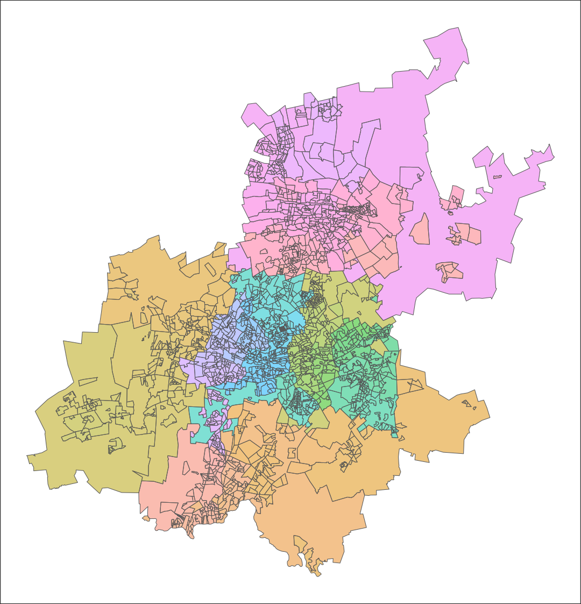

Wihan Marais
2025-05-17

- [`sasf`](#sasf)
  - [Installation](#installation)
  - [Basics](#basics)
  - [Helper Functions](#helper-functions)
- [Acknowledgements](#acknowledgements)
- [Session Information](#session-information)

<!-- README.md is generated from README.Rmd. Please edit that file -->

# `sasf`

<!-- badges: start -->

[](https://lifecycle.r-lib.org/articles/stages.html#experimental)
[](https://CRAN.R-project.org/package=sasf)
<!-- badges: end -->

The goal of `sasf` is to simplify the process of loading and visualising
spatial data for South Africa in `R`. Shapefiles encompass various
administrative levels, such as provinces, districts, municipalities,
main places, and subplaces, using Census 2011 demarcations.

The main dataset of interest `subplaces` data frame is embedded in the
package. `_id` columns represent unique numeric identifiers, while
`_name` columns provide descriptive names. `_mdb` columns present string
identifiers corresponding to the demarcations of the Municipal
Demarcation Board of South Africa for provinces, districts, and
municipalities.

`subplaces` is structured hierarchically on the basis of `_id` values,
with the exception of districts. Consider, for example, the subplace
“Wemmershoek”:

- `subplace_id`: 167007001
- `mainplace_id`: 167007
- `municipality_id`: 167
- `province_id`: 1

## Installation

<!-- This package requires a working installation of [`sf`](https://github.com/r-spatial/sf#installing). -->

You can install the development version of `sasf` from
[GitHub](https://github.com/) with:

``` r
# install.packages("remotes")
remotes::install_github("WihanZA/sasf")
```

## Basics

``` r
# lazy loading of data
lobstr::mem_used()
```

    #> 72.31 MB

``` r
library(sasf)
lobstr::mem_used()
```

    #> 72.63 MB

``` r
invisible(subplaces)
lobstr::mem_used()
```

    #> 115.72 MB

``` r
# geographic hierarchy
subplaces %>%
  # exclude sfc geometry column
  as.data.frame() %>%
  select(ends_with("_id")) %>%
  pivot_longer(everything()) %>%
  group_by(name) %>%
  summarise(n = n_distinct(value)) %>%
  arrange(desc(n))
```

    #> # A tibble: 5 × 2
    #>   name                n
    #>   <chr>           <int>
    #> 1 subplace_id     22108
    #> 2 mainplace_id    14039
    #> 3 municipality_id   234
    #> 4 district_id        52
    #> 5 province_id         9

``` r
# filtering
subplaces %>%
  filter(grepl("stellenbosch", municipality_name, ignore.case = TRUE)) %>%
  head()
```

    #> Simple feature collection with 6 features and 16 fields
    #> Geometry type: POLYGON
    #> Dimension:     XY
    #> Bounding box:  xmin: 18.85507 ymin: -33.92334 xmax: 19.05194 ymax: -33.80165
    #> Geodetic CRS:  WGS84(DD)
    #> # A tibble: 6 × 17
    #>   district_id municipality_name municipality_id province_name mainplace_name
    #>   <chr>       <chr>             <chr>           <chr>         <chr>         
    #> 1 102         Stellenbosch      167             Western Cape  Franschhoek   
    #> 2 102         Stellenbosch      167             Western Cape  Tennantville  
    #> 3 102         Stellenbosch      167             Western Cape  Klapmuts      
    #> 4 102         Stellenbosch      167             Western Cape  Klapmuts      
    #> 5 102         Stellenbosch      167             Western Cape  Klapmuts      
    #> 6 102         Stellenbosch      167             Western Cape  Klapmuts      
    #> # ℹ 12 more variables: province_id <chr>, province_mdb <chr>,
    #> #   district_name <chr>, municipality_mdb <chr>, district_mdb <chr>,
    #> #   mainplace_id <chr>, subplace_name <chr>, subplace_id <chr>,
    #> #   shape_albers <dbl>, shape_length <dbl>, shape_area <dbl>,
    #> #   geometry <POLYGON [°]>

``` r
# plotting
subplaces %>%
  ggplot() +
  geom_sf(
    color = "grey50",
    fill = "white"
  )
```


``` r
# set default ggplot theme
theme_set(
  theme_void() +
    theme(
      legend.position = "bottom",
      legend.box = "vertical"
    )
)

# set GeomSf defaults
update_geom_defaults(
  "sf",
  list(alpha = 0.5)
)
```

``` r
# filtering
# group_by + summarise amounts to sf::st_union()
# plot using defaults
subplaces %>%
  filter(province_name == "Western Cape") %>%
  group_by(district_name) %>%
  summarise() %>%
  ggplot() +
  geom_sf(
    aes(fill = district_name),
    color = "grey50"
  ) +
  labs(
    fill = "District Muncipality",
    title = "Western Cape Districts"
  )
```


## Helper Functions

``` r
# inappropriate figure aspect ratios cause whitespace
ratios <- get_asp(
  sf_obj = subplaces,
  target_width = 6
)

# normal & latitude adjusted (for geographic coordinates) ratios
# corresponding figure heights
ratios
```

    #> $asp
    #> [1] 1.293501
    #> 
    #> $target_width
    #> [1] 6
    #> 
    #> $target_height
    #> [1] 4.638574
    #> 
    #> $asp_adj
    #> [1] 1.136971
    #> 
    #> $target_height_adj
    #> [1] 5.277181

``` r
# illustrate using Gauteng example
gauteng <- subplaces %>%
  filter(province_name == "Gauteng")

# after subsetting subplaces
# optimal aspect ratio changes
ratios_gauteng <- get_asp(gauteng, 6)

# plot gauteng subplaces and save
gauteng_plot <- gauteng %>%
  ggplot() +
  geom_sf(
    aes(fill = subplace_id),
    show.legend = FALSE
  ) +
  theme(
    panel.background = element_rect(fill = "white"),
    plot.background = element_rect(fill = "grey50")
  )

ggsave(
  filename = "asp.png",
  plot = gauteng_plot,
  device = ragg::agg_png,
  path = "man/figures",
  width = ratios_gauteng$target_width,
  height = ratios_gauteng$target_height,
  dpi = 180
)

ggsave(
  filename = "asp_adj.png",
  plot = gauteng_plot,
  device = ragg::agg_png,
  path = "man/figures",
  width = ratios_gauteng$target_width,
  height = ratios_gauteng$target_height_adj,
  dpi = 180
)
```

``` r
knitr::include_graphics("man/figures/asp.png")
```


``` r

```


# Acknowledgements

- The definitions and demarcations used in Census 2011 are detailed in
  the corresponding
  *[metadata](https://www.statssa.gov.za/census/census_2011/census_products/Census_2011_Metadata.pdf)*,
  published by Statistics South Africa (2012).

- The wiki by [konektaz](https://github.com/konektaz) offers a useful
  summary of the hierarchical structure of spatial layers: *[South
  Africa Census 2011 spatial
  metadata](https://github.com/konektaz/shape-files/wiki/South-Africa---Census-2011-spatial-metadata)*

- The original shapefiles were sourced from the [OpenUp Data
  Portal](https://data.openup.org.za/) at this link: *[Census 2011
  Boundaries Subplace
  Layer](https://data.openup.org.za/dataset/census-2011-boundaries-subplace-layer-qapr-gczi/)*

# Session Information

``` r
sessionInfo()
```

    #> R version 4.5.0 (2025-04-11 ucrt)
    #> Platform: x86_64-w64-mingw32/x64
    #> Running under: Windows 11 x64 (build 26100)
    #> 
    #> Matrix products: default
    #>   LAPACK version 3.12.1
    #> 
    #> locale:
    #> [1] LC_COLLATE=English_United Kingdom.utf8 
    #> [2] LC_CTYPE=English_United Kingdom.utf8   
    #> [3] LC_MONETARY=English_United Kingdom.utf8
    #> [4] LC_NUMERIC=C                           
    #> [5] LC_TIME=English_United Kingdom.utf8    
    #> 
    #> time zone: Africa/Johannesburg
    #> tzcode source: internal
    #> 
    #> attached base packages:
    #> [1] stats     graphics  grDevices utils     datasets  methods   base     
    #> 
    #> other attached packages:
    #> [1] sf_1.0-20       tidyr_1.3.1     lubridate_1.9.4 ragg_1.4.0     
    #> [5] ggplot2_3.5.2   dplyr_1.1.4    
    #> 
    #> loaded via a namespace (and not attached):
    #>  [1] gtable_0.3.6       compiler_4.5.0     Rcpp_1.0.14        tidyselect_1.2.1  
    #>  [5] systemfonts_1.2.3  scales_1.4.0       textshaping_1.0.1  yaml_2.3.10       
    #>  [9] fastmap_1.2.0      R6_2.6.1           generics_0.1.4     classInt_0.4-11   
    #> [13] knitr_1.50         tibble_3.2.1       units_0.8-7        DBI_1.2.3         
    #> [17] pillar_1.10.2      RColorBrewer_1.1-3 rlang_1.1.6        xfun_0.52         
    #> [21] timechange_0.3.0   cli_3.6.5          withr_3.0.2        magrittr_2.0.3    
    #> [25] class_7.3-23       digest_0.6.37      grid_4.5.0         lifecycle_1.0.4   
    #> [29] vctrs_0.6.5        KernSmooth_2.23-26 proxy_0.4-27       evaluate_1.0.3    
    #> [33] glue_1.8.0         farver_2.1.2       e1071_1.7-16       rmarkdown_2.29    
    #> [37] purrr_1.0.4        tools_4.5.0        pkgconfig_2.0.3    htmltools_0.5.8.1
