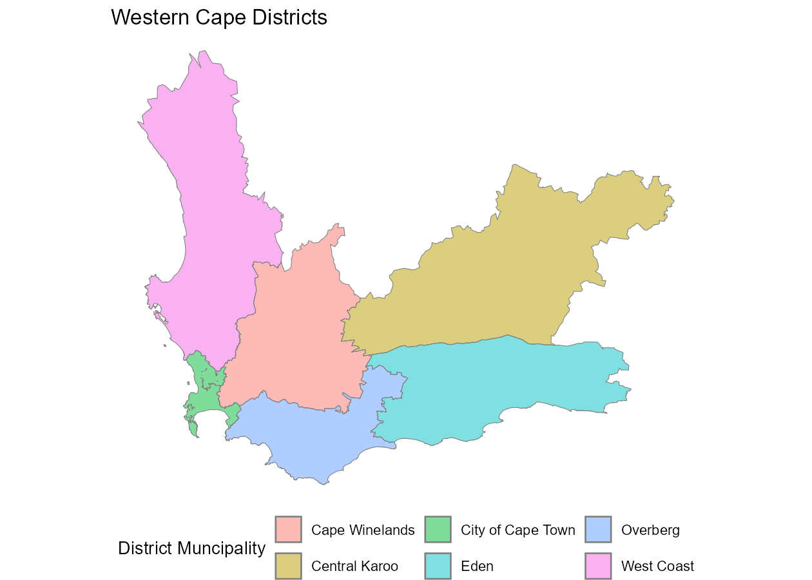

Wihan Marais
2025-05-18

- [`sasf`](#sasf)
  - [Installation](#installation)
  - [Basics](#basics)
  - [Plotting](#plotting)
  - [Helper Functions](#helper-functions)
- [Acknowledgements](#acknowledgements)
- [Session Information](#session-information)

<!-- README.md is generated from README.Rmd. Please edit that file -->

# `sasf`

<!-- badges: start -->

[](https://lifecycle.r-lib.org/articles/stages.html#experimental)
[](https://CRAN.R-project.org/package=sasf)
<!-- badges: end -->

The goal of `sasf` is to simplify the process of loading and visualising
spatial data for South Africa in `R`. Shapefiles encompass various
administrative levels, such as provinces, districts, municipalities,
mainplaces, and subplaces, using Census 2011 demarcations.

The main dataset of interest `subplaces` data frame is embedded in the
package. `_id` columns represent unique numeric identifiers, while
`_name` columns provide descriptive names. `_mdb` columns present string
identifiers corresponding to the demarcations of the Municipal
Demarcation Board of South Africa for provinces, districts, and
municipalities.

## Installation

<!-- This package requires a working installation of [`sf`](https://github.com/r-spatial/sf#installing). -->

You can install the development version of `sasf` from
[GitHub](https://github.com/) with:

``` r
# install.packages("remotes")
remotes::install_github("WihanZA/sasf")
```

## Basics

``` r
library(sasf)

# recommended
library(dplyr)
library(tidyr)
library(ggplot2)
library(sf)
library(ragg)
```

Somewhat large datasets are lazily loaded to reduce the demand on your
system’s memory when they’re not in use. See memory usage before and
after loading the `subplaces` dataset.

``` r
lobstr::mem_used()
```

    #> 72.34 MB

``` r
invisible(subplaces)
lobstr::mem_used()
```

    #> 115.70 MB

`subplaces` is structured hierarchically:

``` r
subplaces %>%
  st_drop_geometry() %>%
  select(ends_with("_id")) %>%
  pivot_longer(everything()) %>%
  group_by(name) %>%
  summarise(n = n_distinct(value)) %>%
  arrange(desc(n))
```

    #> # A tibble: 5 × 2
    #>   name                n
    #>   <chr>           <int>
    #> 1 subplace_id     22108
    #> 2 mainplace_id    14039
    #> 3 municipality_id   234
    #> 4 district_id        52
    #> 5 province_id         9

## Plotting

I recommend the `ggplot2` package for visualising the spatial data:

``` r
subplaces %>%
  ggplot() +
  geom_sf()
```


Maintain consistently formatted figures by setting default themes:

``` r
# set default ggplot theme
theme_set(
  theme_void() +
    theme(
      legend.position = "bottom",
      legend.box = "vertical"
    )
)

# set GeomSf defaults
update_geom_defaults(
  "sf",
  list(alpha = 0.5)
)
```

``` r
subplaces %>%
  filter(province_name == "Western Cape") %>%
  group_by(district_name) %>%
  summarise() %>%
  ggplot(aes(fill = district_name)) +
  geom_sf(color = "grey50") +
  labs(
    fill = "District Muncipality",
    title = "Western Cape Districts"
  )
```



## Helper Functions

Arbitrarily setting generated figures’ dimensions with code chunk
options `fig.width` and `fig.height`, or the `width` and `height`
arguments to `ggsave`, may amount to aspect ratios which don’t
correspond to that of the `sf` object. This leads to redundant
whitespace in the image created by `knitr` or `ggsave`.

To prevent this, the `sasf` package offers the `get_asp` helper
function. It takes an `sf` object (and optionally a figure’s target
width), and returns its inherent aspect ratio (and target height),
accounting for any latitude distortion where present.

The aforementioned unintended whitespace—and the fix provided by
`get_asp`—is best illustrated with images generated using `ggsave`
although the outcome is very much the same as with inappropriate code
chunk options.

``` r
# filter spatial data
gauteng_sf <- subplaces %>%
  filter(province_name == "Gauteng")

# create plot
gauteng_plot <- gauteng_sf %>%
  ggplot() +
  geom_sf(
    aes(fill = subplace_id),
    show.legend = FALSE
  ) +
  theme(
    panel.background = element_rect(fill = "white"),
    plot.background = element_rect(fill = "grey50")
  )

# save images to the same path
fig_path <- "man/figures/readme"

# with arbitrary dimensions 6x5
ggsave(
  filename = "gauteng-whitespace.png",
  plot = gauteng_plot,
  device = ragg::agg_png,
  path = fig_path,
  width = 6,
  height = 5,
  dpi = 180
)

# get ideal asepct ratio for the sf object
# targeting the same width as before
gauteng_asp <- get_asp(
  sf_obj = gauteng_sf,
  target_width = 6
)

gauteng_asp
```

    #> $asp
    #> [1] 0.9620082
    #> 
    #> $target_width
    #> [1] 6
    #> 
    #> $target_height
    #> [1] 6.236953

``` r
# with recommended dimensions
ggsave(
  filename = "gauteng-corrected.png",
  plot = gauteng_plot,
  device = ragg::agg_png,
  path = fig_path,
  width = gauteng_asp$target_width,
  height = gauteng_asp$target_height,
  dpi = 180
)

knitr::include_graphics(file.path(fig_path, "gauteng-whitespace.png"))
knitr::include_graphics(file.path(fig_path, "gauteng-corrected.png"))
```


# Acknowledgements

- Demarcations used by the 2011 Census are detailed in the
  *[metadata](https://www.statssa.gov.za/census/census_2011/census_products/Census_2011_Metadata.pdf)*
  published by Statistics South Africa (2012).

- The wiki by [konektaz](https://github.com/konektaz) offers a useful
  summary of the hierarchical structure of spatial layers: *[South
  Africa Census 2011 spatial
  metadata](https://github.com/konektaz/shape-files/wiki/South-Africa---Census-2011-spatial-metadata)*

- The original shapefiles were sourced from the [OpenUp Data
  Portal](https://data.openup.org.za/) at this link: *[Census 2011
  Boundaries Subplace
  Layer](https://data.openup.org.za/dataset/census-2011-boundaries-subplace-layer-qapr-gczi/)*

# Session Information

``` r
sessionInfo()
```

    #> R version 4.5.0 (2025-04-11 ucrt)
    #> Platform: x86_64-w64-mingw32/x64
    #> Running under: Windows 11 x64 (build 26100)
    #> 
    #> Matrix products: default
    #>   LAPACK version 3.12.1
    #> 
    #> locale:
    #> [1] LC_COLLATE=English_United Kingdom.utf8 
    #> [2] LC_CTYPE=English_United Kingdom.utf8   
    #> [3] LC_MONETARY=English_United Kingdom.utf8
    #> [4] LC_NUMERIC=C                           
    #> [5] LC_TIME=English_United Kingdom.utf8    
    #> 
    #> time zone: Africa/Johannesburg
    #> tzcode source: internal
    #> 
    #> attached base packages:
    #> [1] stats     graphics  grDevices utils     datasets  methods   base     
    #> 
    #> other attached packages:
    #> [1] ragg_1.4.0    sf_1.0-20     ggplot2_3.5.2 tidyr_1.3.1   dplyr_1.1.4  
    #> [6] sasf_1.0.0   
    #> 
    #> loaded via a namespace (and not attached):
    #>  [1] gtable_0.3.6       compiler_4.5.0     tidyselect_1.2.1   Rcpp_1.0.14       
    #>  [5] textshaping_1.0.1  systemfonts_1.2.3  scales_1.4.0       yaml_2.3.10       
    #>  [9] fastmap_1.2.0      lobstr_1.1.2       R6_2.6.1           generics_0.1.4    
    #> [13] classInt_0.4-11    s2_1.1.8           knitr_1.50         tibble_3.2.1      
    #> [17] units_0.8-7        lubridate_1.9.4    DBI_1.2.3          RColorBrewer_1.1-3
    #> [21] pillar_1.10.2      rlang_1.1.6        utf8_1.2.5         xfun_0.52         
    #> [25] timechange_0.3.0   cli_3.6.5          withr_3.0.2        magrittr_2.0.3    
    #> [29] wk_0.9.4           class_7.3-23       digest_0.6.37      grid_4.5.0        
    #> [33] lifecycle_1.0.4    prettyunits_1.2.0  vctrs_0.6.5        KernSmooth_2.23-26
    #> [37] proxy_0.4-27       evaluate_1.0.3     glue_1.8.0         farver_2.1.2      
    #> [41] codetools_0.2-20   e1071_1.7-16       rmarkdown_2.29     purrr_1.0.4       
    #> [45] tools_4.5.0        pkgconfig_2.0.3    htmltools_0.5.8.1
